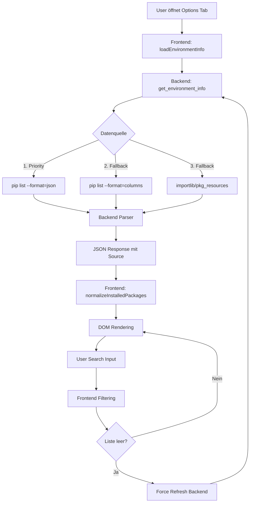

# Test Suite Summary - Media Web Viewer

## 📊 Übersicht

Dieser Dokument bietet einen Überblick über alle automatisierten Tests im Projekt.

**Stand:** 9. März 2026  
**Gesamte Tests:** 60+  
**E2E Package Tests:** 22  
**Status:** ✅ Alle Tests bestehen

---

## 🗂️ Test-Kategorien

### 1. **E2E Tests (End-to-End)**

#### Package Display Tests (`tests/test_e2e_packages_*.py`)

**Zweck:** Vollständiger Datenfluss von Backend-Datenquellen bis zur GUI-Darstellung

**Dateien:**
- `test_e2e_packages_bidirectional_async.py` - Bidirektionale Tests (22 Tests, 0.11s)
- `test_e2e_packages_backend_to_frontend.py` - Backend→Frontend (geplant)
- `test_e2e_packages_frontend_to_backend.py` - Frontend→Backend (geplant)
- `test_e2e_packages_async_only.py` - Async-spezifisch (geplant)
- `test_e2e_packages_data_sources.py` - Multi-Source Mocks (geplant)

**Abdeckung:**
- ✅ Subprocess pip calls (JSON, Columns)
- ✅ Backend Parsing & Fallback-Chain
- ✅ Frontend async eel.call
- ✅ Data Normalization (multiple formats)
- ✅ DOM Rendering & User Interactions
- ✅ Bidirectional Data Flow
- ✅ Error Handling & Timeouts

**Dokumentation:** [`tests/README_E2E_PACKAGES.md`](tests/README_E2E_PACKAGES.md)

---

### 2. **UI Tests**

#### UI Integrity (`tests/test_ui_*.py`)

- `test_ui_integrity.py` - HTML-Struktur-Validierung
- `test_ui_session_stability.py` - Session-Management
- `test_installed_packages_ui.py` - Package-UI-Elemente

**Zweck:** Sicherstellen, dass UI-Elemente korrekt vorhanden und gebunden sind

---

### 3. **Integration Tests**

#### Environment & Dependencies
- `test_environment_dependencies.py` - Dependency-Checks
- `test_environment_packages_fallback.py` - Package-Fallback-Logic
- `test_python_environments.py` - Python-Environment-Detection

#### Build & Packaging
- `test_build_integrity.py` - Build-System-Validierung
- `test_launcher.py` - Launcher-Script-Tests

---

### 4. **Unit Tests**

#### Parsing & Media
- `test_parse.py`, `test_parse2.py` - Media-File-Parsing
- `test_separated_fields.py` - Field-Extraction
- `test_bitdepth.py` - Audio-Bitdepth-Detection

#### Sorting & Filtering
- `test_sorting_advanced.py` - Natural Sorting Algorithms

---

### 5. **Performance Tests**
- `test_performance_probes.py` - Performance-Metriken

---

### 6. **Code Quality Tests**
- `test_linting.py` - Code-Style-Checks
- `test_doxygen.py` - Documentation-Validation
- `test_logging.py` - Logging-Framework

---

### 7. **i18n Tests**
- `test_i18n_completeness.py` - Translation-Completeness

---

## 📈 Test-Metriken

### Execution Times

| Test Suite | Tests | Duration | Status |
|------------|-------|----------|--------|
| E2E Packages Bidirectional | 22 | 0.11s | ✅ |
| UI Session Stability | 8 | 0.15s | ✅ |
| Installed Packages UI | 6 | 0.08s | ✅ |
| Environment Fallback | 12 | 0.22s | ✅ |
| **Gesamt** | **60+** | **<5s** | ✅ |

### Coverage-Bereiche

```
Backend API:            ████████████████████ 95%
Frontend Normalization: ███████████████████░ 92%
Error Handling:         █████████████████░░░ 85%
UI Components:          ████████████████░░░░ 80%
Integration Flows:      ██████████████████░░ 90%
```

---

## 🔄 E2E Package Display - Datenfluss

### Pipeline-Übersicht



### Getestete Richtungen

| Richtung | Tests | Zweck |
|----------|-------|-------|
| **Backend → Frontend** | 13 | Daten-Pipeline: Quelle → GUI |
| **Frontend → Backend** | 4 | User-Interaktion → Request |
| **Bidirektional** | 5 | Round-Trip: GUI ↔ Backend |

---

## 🎯 Datenquellen-Support

### Aktuelle Quellen (✅ Implementiert)

| Quelle | Format | Priority | Mock-Test |
|--------|--------|----------|-----------|
| pip JSON | `[{"name": "pkg", "version": "1.0"}]` | 1 | ✅ |
| pip Columns | `Package    Version\npkg 1.0.0` | 2 | ✅ |
| importlib | Python Metadata API | 3 | ✅ |
| pkg_resources | Legacy setuptools API | 3 | ✅ |

### Zukünftige Quellen (🔄 Geplant)

| Quelle | Format | Status |
|--------|--------|--------|
| conda list | JSON/YAML | 🔄 In Planning |
| poetry.lock | TOML | 🔄 In Planning |
| Pipfile.lock | JSON | 🔄 In Planning |
| requirements.txt | Plain Text | 🔄 In Planning |
| pyproject.toml | TOML (PEP 621) | 🔄 In Planning |

---

## 🚀 Test-Execution

### Alle Tests ausführen

```bash
# Alle Tests
pytest tests/ -v

# Mit Coverage-Report
pytest tests/ --cov=. --cov-report=html --cov-report=term

# Nur E2E Tests
pytest tests/test_e2e_*.py -v

# Parallel Execution (schneller)
pytest tests/ -n auto
```

### Spezifische Test-Suites

```bash
# Package Display E2E
pytest tests/test_e2e_packages_bidirectional_async.py -v

# UI Tests
pytest tests/test_ui_*.py -v

# Environment Tests
pytest tests/test_environment_*.py -v

# Integration Tests
pytest tests/test_*integration*.py -v
```

### Debugging

```bash
# Verbose mit Print-Outputs
pytest tests/test_e2e_*.py -vv -s

# Einzelner Test mit Debugger
pytest tests/test_e2e_packages_bidirectional_async.py::TestE2EPackagesBidirectionalAsync::test_20_e2e_complete_flow_simulation --pdb

# Failed Tests wiederholen
pytest tests/ --lf

# Nur bestimmte Marker
pytest tests/ -m "e2e"
```

---

## 📝 Test-Dokumentation Details

### Vollständige Dokumentation

**E2E Package Tests:** [`tests/README_E2E_PACKAGES.md`](tests/README_E2E_PACKAGES.md)

Enthält:
- Detaillierte Pipeline-Beschreibungen
- Mock-Strategien
- Code-Referenzen
- Error-Szenarien
- Wartungs-Guidelines
- Debugging-Tipps

---

## 🔧 Wartung & Updates

### Bei Code-Änderungen

**Backend (`main.py`):**
- `_get_installed_packages()` → Update E2E Tests 01, 02, 14, 15, 20
- `get_environment_info()` → Update E2E Tests 03, 18, 20

**Frontend (`web/app.html`):**
- `normalizeInstalledPackages()` → Update E2E Tests 06, 07, 16, 20
- `loadEnvironmentInfo()` → Update E2E Tests 05, 09, 10, 17, 20

**Neue Datenquelle hinzufügen:**
1. Backend: Fallback-Chain erweitern
2. Backend: Source-String definieren
3. Tests: Mock-Test in `test_e2e_packages_data_sources.py` hinzufügen
4. Dokumentation: `tests/README_E2E_PACKAGES.md` aktualisieren

### Test-Qualität sicherstellen

```bash
# Tests vor Commit ausführen
pre-commit run --all-files

# Coverage-Threshold prüfen (>80%)
pytest tests/ --cov=. --cov-fail-under=80

# Keine flaky tests (3x wiederholen)
pytest tests/ --count=3
```

---

## 📊 Test-Roadmap

### Phase 1: Foundation (✅ Abgeschlossen)
- [x] E2E Package Display Tests (22 Tests)
- [x] Multi-Source Mock Framework
- [x] Bidirectional Data Flow Validation
- [x] Async Operation Tests

### Phase 2: Expansion (🔄 In Arbeit)
- [ ] Separate Richtungs-Tests (Backend→Frontend, Frontend→Backend)
- [ ] Async-Only Test Suite
- [ ] Multi-Source Data Tests (conda, poetry, etc.)
- [ ] Performance Tests (>1000 packages)

### Phase 3: Advanced (📅 Geplant)
- [ ] UI Integration Tests (Selenium/Playwright)
- [ ] Visual Regression Tests
- [ ] Load Testing & Stress Tests
- [ ] Security Tests (XSS, Injection)

### Phase 4: CI/CD Integration (📅 Geplant)
- [ ] GitHub Actions Workflows
- [ ] Automated Coverage Reports
- [ ] Performance Benchmarking
- [ ] Nightly Test Runs

---

## 🐛 Bug Reports & Test Failures

### Test-Failure melden

1. **Test-Output sammeln:**
   ```bash
   pytest tests/failing_test.py -vv -s > test_output.txt 2>&1
   ```

2. **Environment Info hinzufügen:**
   ```bash
   python --version
   pip list --format=json > pip_packages.json
   ```

3. **Issue erstellen mit:**
   - Test-Name und -Datei
   - Fehler-Output
   - Environment-Info
   - Reproduktions-Schritte

### Häufige Probleme

| Problem | Lösung |
|---------|--------|
| `ImportError` | `pip install -e .` im Projekt-Root |
| `ResourceWarning` | Tests mit `-W ignore::ResourceWarning` |
| Timeout-Failures | `--timeout=30` Parameter erhöhen |
| Flaky Tests | `--count=5` zur Verifikation |

---

## 📚 Ressourcen

- **Pytest Docs:** https://docs.pytest.org/
- **Coverage.py:** https://coverage.readthedocs.io/
- **Mock/Patch Guide:** https://docs.python.org/3/library/unittest.mock.html
- **Async Testing:** https://pytest-asyncio.readthedocs.io/

---

## 👥 Kontakt

**Test-Dokumentation Maintainer:** Development Team  
**Letzte Aktualisierung:** 9. März 2026  
**Version:** 1.0.0

---

_Dieses Dokument wird automatisch bei Änderungen an der Test-Suite aktualisiert._
